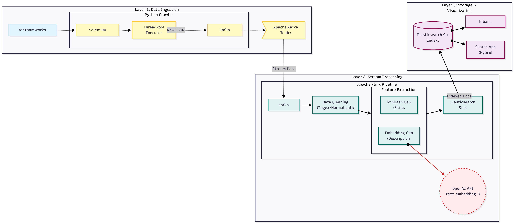

# Job Search Engine & Recommendation System
## Introduction
This project is an end-to-end Big Data pipeline designed to match candidates (CVs) with relevant job postings (JDs) in real-time. What it does:
1. Extract all features in your PDF and group them as: job title, experience, description, list of skills
2. Crawl real-time data of Job Post from popular website
3. Save in high-performance data storage enabling streaming and searching through large amount of data
4. Perform semantic matching to find jobs that best applicable for you


## Data 
Propose a modular **Producer-Consumer pattern** across three layers:

### 1. Ingestion Layer (Producer)
* **Tools:** Selenium WebDriver, Python ThreadPool, Apache Kafka.
* **Function:** Crawls job data concurrently from dynamic web sources and buffers data into Kafka topics to ensure durability and back-pressure handling [8].

### 2. Stream Processing Layer (Engine)
* **Tools:** Apache Flink (PyFlink), OpenAI API.
* **Function:** Consumes Kafka streams, cleans data using Regex, and performs feature extraction:
    * **Semantic Vectors:** 1536-dim vectors via OpenAI `text-embedding-3-small` [9].
    * **Skill Signatures:** MinHash signatures for $O(1)$ skill set similarity [10].

### 3. Storage & Retrieval Layer (Consumer)
* **Tools:** Elasticsearch (9.x), Kibana.
* **Function:** Indexes enriched documents and executes Hybrid Search queries [11].

## Hybrid Searching
To match a CV to a Job Description, we use Reciprocal Rank Fusion (RRF) to combine results from three distinct methods:

| Component | Technique | Weight | Purpose |
| :--- | :--- | :--- | :--- |
| **Semantic Search** | Dense Vector Cosine Similarity | `1.2` | Captures contextual meaning (e.g., "Backend" $\approx$ "Server-side"). |
| **Skill Matching** | LSH (MinHash) | `1.5` | Efficient, exact matching of technical skill sets (Jaccard similarity). |
| **Keyword Search** | BM25 | `1.0` | Probabilistic matching for exact Job Titles. |
## Running
We organize our repo as:
```text
project
|
|--cv_extract % User CV extraction, run as FastAPI service
|       |---- setup.md 
|       |---- .........
|
|--data_pipeline # Get data for searching, currently on working
|       |---- setup.md
|       |---- .........
```
Each repository requires different environment and library that cause conflicts (that is why we project CV extractor as a service). Please follow the setup.md in each folder to set up and run the project.

