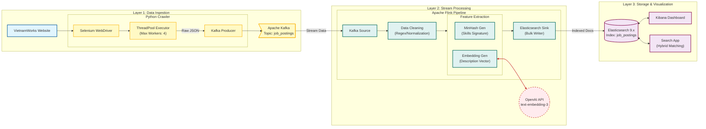

# System Architecture

Dưới đây là sơ đồ kiến trúc hệ thống:

```mermaid
graph LR
    %% Định nghĩa Style
    classDef source fill:#e1f5fe,stroke:#01579b,stroke-width:2px;
    classDef ingest fill:#fff9c4,stroke:#fbc02d,stroke-width:2px;
    classDef process fill:#e0f2f1,stroke:#00695c,stroke-width:2px;
    classDef storage fill:#f3e5f5,stroke:#880e4f,stroke-width:2px;
    classDef external fill:#ffebee,stroke:#c62828,stroke-width:2px,stroke-dasharray: 5 5;

    %% --- PHẦN 1: DATA SOURCE & INGESTION ---
    subgraph Ingestion_Layer [Layer 1: Data Ingestion]
        direction TB
        VNW[VietnamWorks Website]:::source
        
        subgraph Python_Crawler [Python Crawler]
            Selenium[Selenium WebDriver]:::ingest
            %% Đã thêm ngoặc kép "..." vào nội dung bên dưới
            Workers["ThreadPool Executor<br/>(Max Workers: 4)"]:::ingest
            KProducer[Kafka Producer]:::ingest
        end
        
        %% Đã thêm ngoặc kép
        Kafka_Topic>"Apache Kafka<br/>Topic: job_postings"]:::ingest
    end

    %% --- PHẦN 2: STREAM PROCESSING ---
    subgraph Processing_Layer [Layer 2: Stream Processing]
        direction TB
        subgraph PyFlink_Pipeline [Apache Flink Pipeline]
            F_Source[Kafka Source]:::process
            %% Đã thêm ngoặc kép
            F_Clean["Data Cleaning<br/>(Regex/Normalization)"]:::process
            
            subgraph Enrichment [Feature Extraction]
                %% Đã thêm ngoặc kép
                MinHash["MinHash Gen<br/>(Skills Signature)"]:::process
                Vector["Embedding Gen<br/>(Description Vector)"]:::process
            end
            
            %% Đã thêm ngoặc kép
            F_Sink["Elasticsearch Sink<br/>(Bulk Writer)"]:::process
        end
        
        %% Đã thêm ngoặc kép
        OpenAI(("OpenAI API<br/>text-embedding-3")):::external
    end

    %% --- PHẦN 3: STORAGE & SEARCH ---
    subgraph Storage_Layer [Layer 3: Storage & Visualization]
        %% Đã thêm ngoặc kép cho node Database
        ES[("Elasticsearch 9.x<br/>Index: job_postings")]:::storage
        Kibana[Kibana Dashboard]:::storage
        %% Đã thêm ngoặc kép
        SearchApp["Search App<br/>(Hybrid Matching)"]:::storage
    end

    %% --- LUỒNG DỮ LIỆU ---
    VNW --> Selenium
    Selenium --> Workers
    Workers -- "Raw JSON" --> KProducer
    KProducer --> Kafka_Topic
    
    Kafka_Topic -- "Stream Data" --> F_Source
    F_Source --> F_Clean
    F_Clean --> Enrichment
    
    Vector <--> OpenAI
    Enrichment --> F_Sink
    
    F_Sink -- "Indexed Docs" --> ES
    ES <--> Kibana
    ES <--> SearchApp

    %% Chú thích đường link API (màu đỏ)
    linkStyle 7 stroke:#c62828,stroke-width:2px;
```